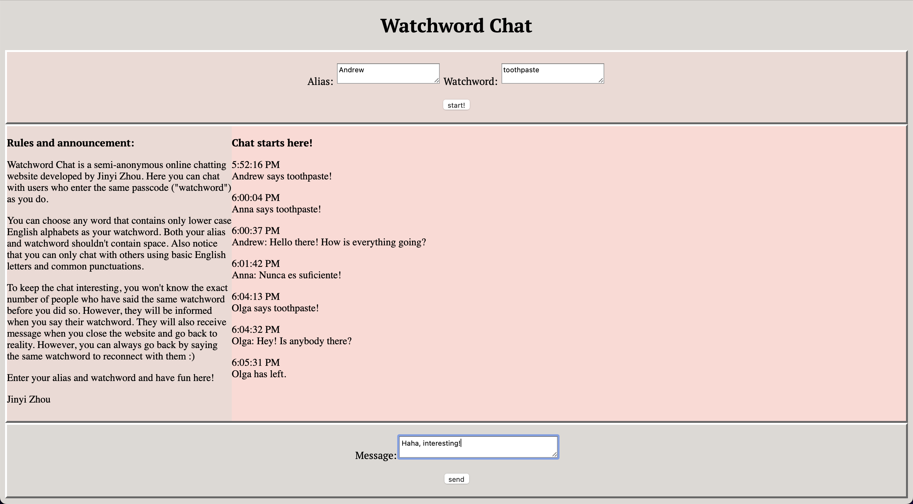
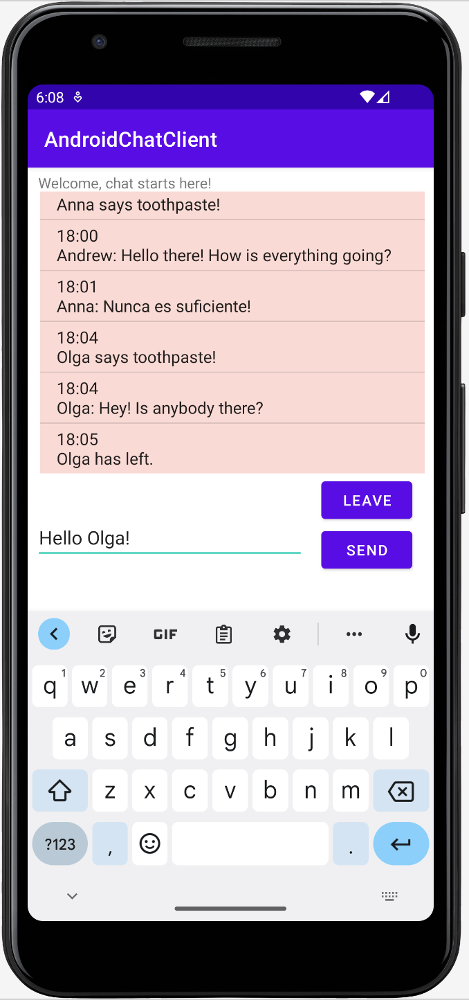

# Watchword Chat - Web/Android Online Chat Application
## Introduction
In **Watchword Chat**, a user can chat with other users who choose the same passcode (that is, ["watchword"](https://www.merriam-webster.com/dictionary/watchword)) as they do. The program uses multithread web server to handle HTTP and/or WebSocket requests. The server records the client's actions (namely, creating/joining existing watchwords, leaving the chat, and sending messages), parses the information in JSON, and sends back to appropriate clients.
### How to start
Simply run ```server/src/Main``` and:
* go to ```localhost:8080``` in web browser to access the web application.
* run ```AndroidChatClient``` to access the Android application.
## Example screenshots
### Webpage application

### Android application

## Credits
Developed by Jinyi Zhou. The idea is mainly based on a homework assignment in the CS6011 Computer Programming class of the Master of Software Development program at the University of Utah.